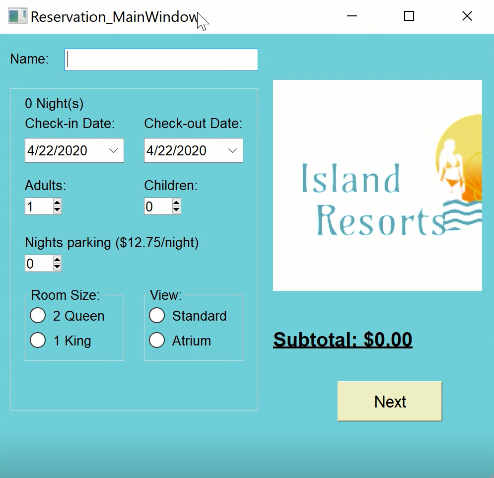
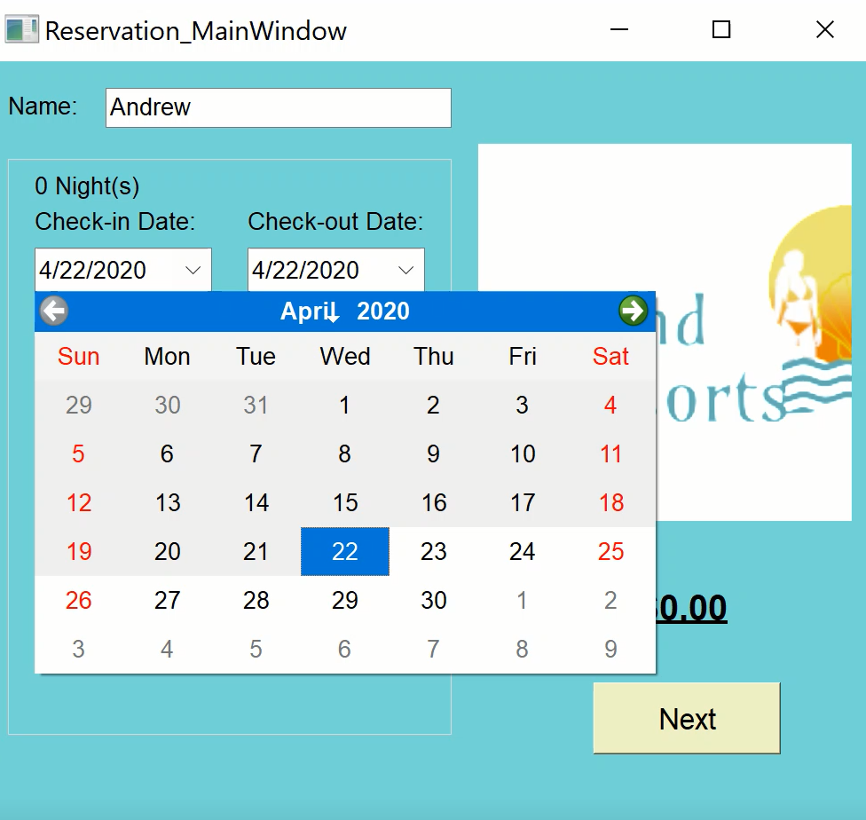
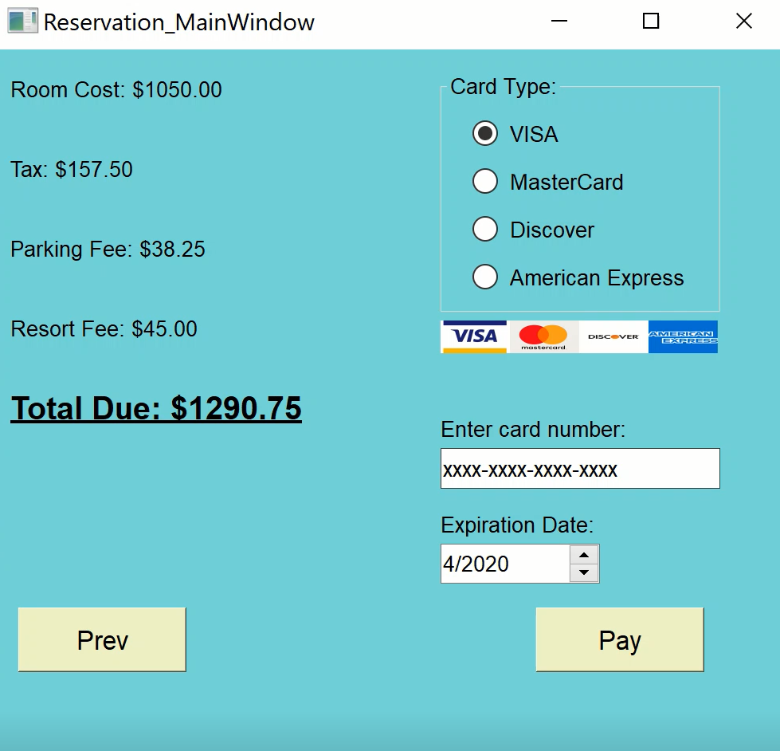
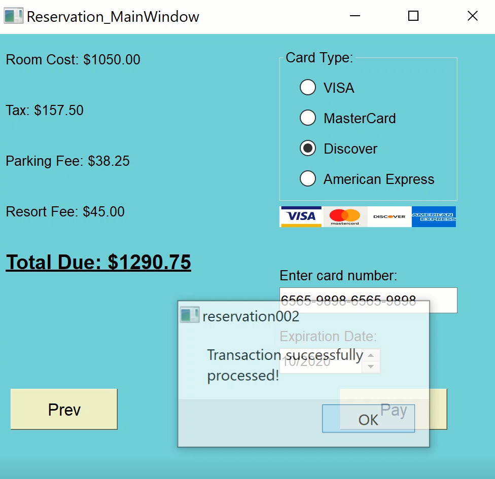
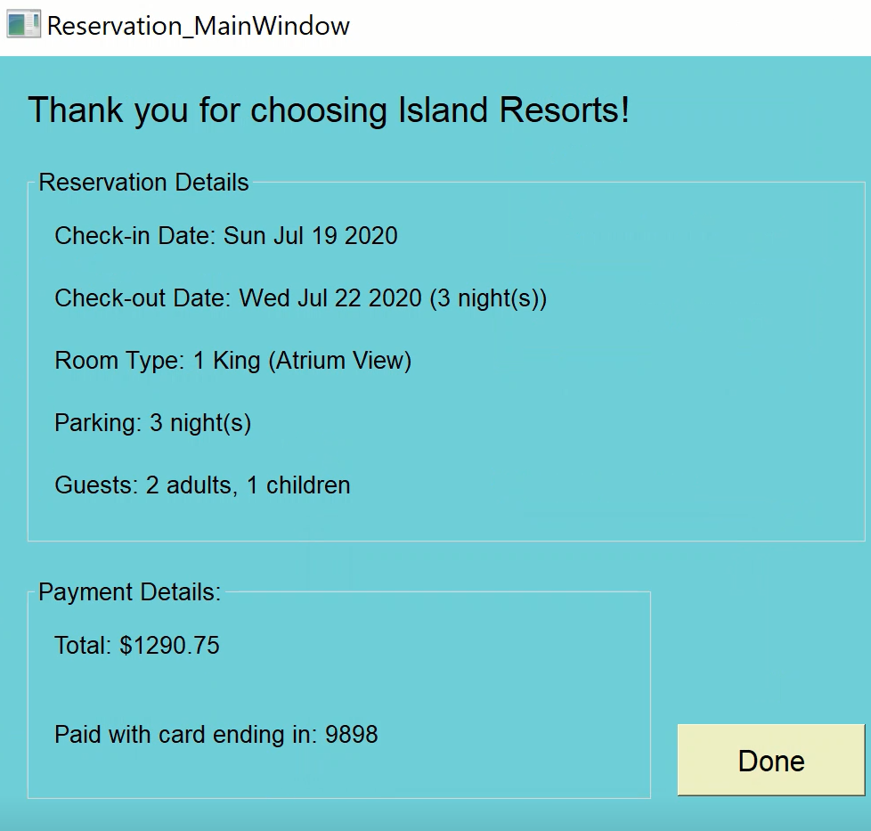

# QtReservation
Reservation app on Qt5

Page 1: Reservation Details

Use StackedWidget to make multiple pages. Check out the video tutorial first. In Page 1, · The user will enter her/his name as the reservation name. · There are two types of rooms in terms of Size: 2 queen bed and 1 king bed. · There are two types of rooms in terms of View: Standard and Atrium. o A user can choose one room size and one view type. · The price of each room type is as follows: o A Standard 2-queen room costs $284 per night o An Atrium 2-queen room costs $325 per night o A Standard 1-king room costs $290 per night o An Atrium 1-king room costs $350 per night · The user can reserve only one room. · The user should be able to choose the first day of stay. · The user can reserve room(s) for between 1 and 7 nights. · The user needs to enter the total number of adults (18+ years of age) and children respectively. o There must be at least 1 adult. Children are optional. o For 2-queen room, maximum number of guests is 4. o For 1-king room, maximum number of guests is 3. o HINT – can any of this be handled using a spinbox with minimum or maximum values? · The user can select optional vehicle parking (for $12.75 per night). · The user should be able to get an idea of cost (not including taxes and fees yet) in this page in real time as they choose/change the above options. · This page should show ‘next’ button to proceed to the next page, once a user enters all necessary information.

Page 2: Cost and Payment Information

· This page should display the charges calculated. Use multiple labels to display these. This includes Charges for: o Room o Tax (which is 15% and applies ONLY to the room charge, not parking or Resort Fee – see below for Resort fee) o Parking Fee - $12.75 per night o Resort fee - $15 per night

o Total due · This page asks the user to type in the credit card information, with either a VISA, MasterCard, Discover or American Express Card. You should give a set of radio buttons for the user to choose first. o Once they select the card type, they can enter their card number. The box for entering the number should be formatted for the type of card they are using (see table at the end of this assignment). You may use dashes or another character if you prefer for separating the numbers. Note that the 3, 4, 5, and 6 as the first digit denotes that American Express card numbers start with 3, VISA with 4 and so on. (Beyond that we are not validating credit cards for this assignment.) o The user should also enter the expiration date (mm/yyyy) for the card. · Include a ‘pay’ button which will finalize the transaction. Once clicked, a dialog message box informing that the transaction was successfully processed, then the next page will appear. · Include a ‘back’ button to get back to the page 1 and change the booking information.

Page 3: Reservation Confirmation

· Display a confirmation message with: o The reservation details § First day, how many nights, room type, parking included or not, how many adults/children o The payment information § Total amount § Paid with credit card ending with xxxx (the last 4 digits) o If you can thank the user it’d look more polite. · Include a close button that will terminate the app.

